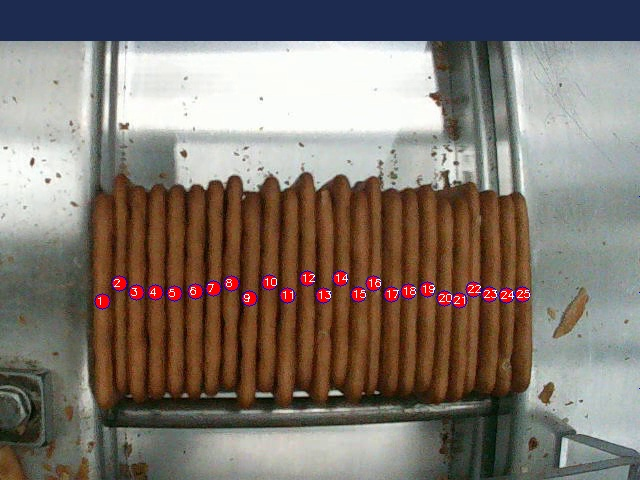

# Bem Vindo a Documentação do PICOS

O **PICOS (Plataforma Inteligente de Contagem de Objetos Selecionados)** é uma plataforma para contagem de objetos a partir de um modelo treinado previamente.  
OBS: Atualmente o projeto está setado apenas para contagem de biscoitos.

## 📷 Exemplo de Saída
Abaixo está um exemplo de saída para um modelo treinado para contar biscoitos.

## 🔥 Principais Recursos

- Detecção precisa de objetos em imagens.
- Compatível com Faster R-CNN e YOLOv8.
- Interface simples para upload e análise de imagens.

## 📌 Objetivo
Este projeto visa automatizar a contagem de objetos treinados previamente para aplicação industrial.

OBS: Atualmente o projeto está setado apenas para contagem de biscoitos.