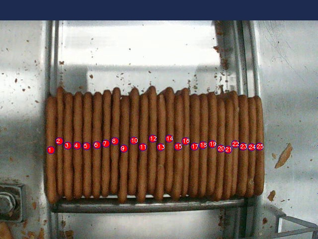

# 📦 Modelo de Contagem de Biscoitos

Este modelo de visão computacional foi treinado para contar o número de biscoitos em uma imagem usando **FRCNN Resnet50**.

## 📊 Especificações do Modelo
| Propriedade        | Valor                     |
|--------------------|-------------------------|
| Arquitetura       | FRCNN Resnet50           |
| Dataset          | Custom       |
| Formato de Entrada | Imagens JPG/PNG         |
| Resolução        | 640x640                   |
| Otimização       | -       |
| Tempo de Treinamento | -      |
| Precisão (mAP@50) | -                   |

## 🏗️ Treinamento do Modelo
O modelo foi treinado utilizando a seguinte abordagem:

1. **Gravação do Vídeo**

      - Para gravar o vídeo com a camera Gx se utiliza o script python que está em src/gravar_gx.py, rodando e apertando em G para gravar.
      O vídeo vai ser salvo em data/videos.

2. **Pegar valores da configuração do corte do vídeo**

      - O vídeo gravado precisa ser cortado na dimensão 640x640 para treinar e rodar o modelo.

      - Para isso o script em src/config_cropped_video.py abre o vídeo escolhido e apresenta um Quadrado, que bote ser aumentado para abranger toda a área de interesse.

      - Após concluído os valores de 'Tamanho da área de interesse', 'Localização em X', 'Localização em Y' são salvos no arquivo config.txt, para ser o valor padrão quando o aplicativo é aberto.

3. **Gerar imagens para o treinamento**
      
      - O script save_image_cropped_interval pega o vídeo original, puxa as configurações de corte no config.txt e salva imagens a cada interval_seconds, definido pelo usuário.

      - As imagens salvas serão utilizadas para o treinamento do modelo

4. **Pré-processamento e marcações**: 

      - As imagens obtidas no passo anterior são pré processadas e marcadas pelo usuário no Roboflow.
      - Não utilizar tecnicas de Albumentation que corte a imagem, pois queremos o biscoito completo, portanto usar apenas os métodos que alteram cor, saturação, ruido, entre outros.
      - O modo de exportação final deve ser o COCO.

5. **Treinamento do modelo**

      - Após exportar os dados, descompacte a pasta e utilize para treinar o modelo, utilizando o pipeline/01.train_count_cookies.ipynb.

      - A Etapa 1 é para importações, a Etapa 2 para carregar o diretório das imagens (que foram exportadas), a Etapa 3 um teste das imagens exportadas, a Etapa 4 para o treino com o Faster RCNN, depois exportar para ONNX, e futuramente para TensorRT (não foi feito ainda).

      - O modelo salvo estará em .pth (para Faster RCNN) ou .onnx (para ONNX), e para utiliza-lo é necessário apontar para ele no arquivo src/func/picos_load_model.py.

## 📷 Exemplo de Saída
Abaixo está um exemplo de saída do modelo:

