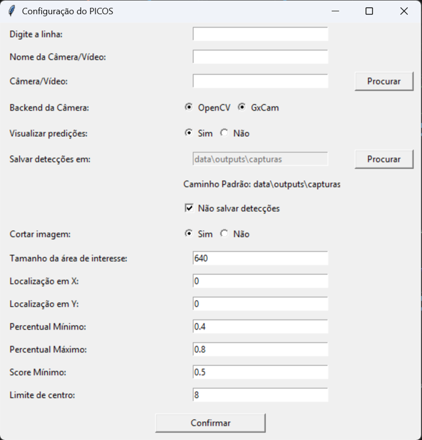
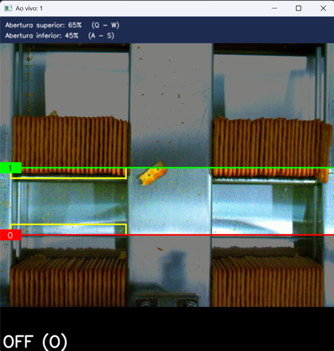

# 🛠️ Como Usar o PICOS

Este guia descreve como utilizar a **Plataforma Inteligente de Contagem de Objetos Selecionados (PICOS)** para realizar a contagem de biscoitos em imagens.

## 🚀 Passos para Utilização

### 1. Descompactar os arquivos

  Crie uma pasta para o projeto e descompacte os arquivos.

### 2. Instalando o ambiente virtual
  Siga em Passo a Passo em: [Instalação](installation.md)

### 3. Rodando o programa
  Para rodar o **PICOS**, execute o seguinte comando:

  ```bash
  python app/run_picos.py
  ```

  Abrirá a seguinte tela:

  

  A tela serve para configurar os parâmetros iniciais do programa, são eles:

  **Digite a linha**: Nome da linha em que o programa está rodando

  **Nome da Câmera/Vídeo**: Nome que o usuário quer dar a Câmera ou Vídeo.

  
  **Câmera/Vídeo**: Digitar o número da câmera (0, 1, 2...) ou escolher o caminho do vídeo.
  
  **Backend da Câmera**: Decide qual classe irá ser utilizada para abrir a imagem, marque OpenCV para câmeras como WebCam ou para abrir vídeos, e use GxCam para abrir câmeras tipo Gx.
  
  **Visualizar predições**: Marque 'Sim' para mostrar a imagem dos resultados na tela, e 'Não' para rodar sem interface.
  
  **Salvar detecções em**: Local onde ficarão salvas as imagens e o arquivo csv com os resultados. Marque o campo 'Não salvar detecções' caso não queria salvar.
  
  **Cortar imagem**: Marque 'sim' caso a dimensão da imagem seja diferente de 640x640 e 'não' caso seja igual.
  
  **Tamanho da área de interesse**: Utilizado para cortar a imagem, representa o tamanho do retângulo, e é definido em src/config_cropped_video.py. Caso Cortar 
  Imagem = 'não', não é necessário se preocupar com esse campo
  
  **Localização em X**: Utilizado para cortar a imagem, representa a localização em X do retângulo, e é definido em src/config_cropped_video.py. Caso Cortar Imagem = 'não', não é necessário se preocupar com esse campo
  
  **Localização em Y**: Utilizado para cortar a imagem, representa a localização em Y do retângulo é definido em src/config_cropped_video.py. Caso Cortar Imagem = 'não', não é necessário se preocupar com esse campo
  
  **Percentual Máximo**: Indica a posição inicial da porcentagem da altura em que a linha de trigger superior vai estar. Pode ser alterada após iniciar.
  
  **Percentual Mínimo**: Indica a posição inicial da porcentagem da altura em que a linha de trigger inferior vai estar. Pode ser alterada após iniciar.
  
  **Score Mínimo**: Indica a porcentagem mínima de certeza de que aquilo é um objeto para ser reconhecido pelo modelo.
  
  **Limite de Centro**: Ferramenta utilizada para ignorar detecções duplicadas. O Limite de Centro cria um raio do tamanho definido, onde qualquer outra detecção dentro dele é ignorada.

  Ao clicar em confirmar é aberta a Câmera ou o Vídeo no modo de configuração, permitindo ser alterado o Percentual Máximo (Q-W) e Percentual Mínimo (A-S). Apertando na tecla O o programa ligará o modelo para detectar.

  

  O modelo só roda quando o trigger é ativado. O trigger funciona pegando as cores que passam pelo retângulo amarelo e verificando se a média das cores dentro dele se aproximam do marrom. Quando o trigger é ativado, ele só pode ser ativado novamente quando passar uma rodada onde não tem biscoitos (cor do retangulo se aproxima da cor da esteira).

  OBS: O modelo foi configurado inicialmente para rodar com a WebCam para apenas uma fileira. Para o GxCam é necessário configurar as regras de detecção e também criar uma regra para separar o lado esquerdo e o lado direito.

  